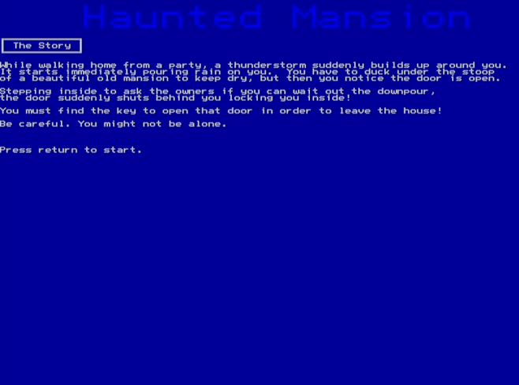

# fnxgamejam-haunted-mansion
A Spooky Adventure  for the Foenix256 computer, written as part of the October 2024 Game Jam

## The Pitch
Haunted Mansion - Walking home after a party, a sudden thunderstorm builds up and starts pouring rain on you.  You have to duck under the stoop of a beautiful old mansion to keep dry, but then notice the door is open.  Stepping inside to ask the owners if you can wait out the downpour, the door suddenly shuts behind you locking you inside! 

You must find the key to open that door in order to leave the house!  Explore 9 rooms! Solve puzzles to progress!  Maybe avoid a ghost or something if I have time!  Perhaps be entertained!

Can I write Haunted Mansion in two days?  And if I do... can you escape it?  👻

## And we did it!
A complete adventure in the required time and it's simple but it was a lot of fun.  Take a look and if you have a Foenix 256 machine, please try it for yourself!

## Details
This game is a simple text adventure in SuperBasic for the F256 computer.

Start it by putting on the media of your choice/SDcard and running with `run "m.bas"`.

Enter commands in lowercase only!

Try `help` to see basic commands.  You can go north, south, west, east, up, and down.

Good luck and thanks for playing!

## GRAPHICS UPDATE!!! 
If you want to play with graphics, you must also copy all the ".bin" files to the same drive as the basic program.  Then run as normal and choose graphics mode.